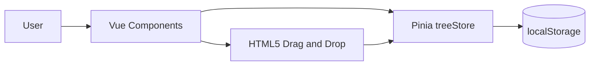
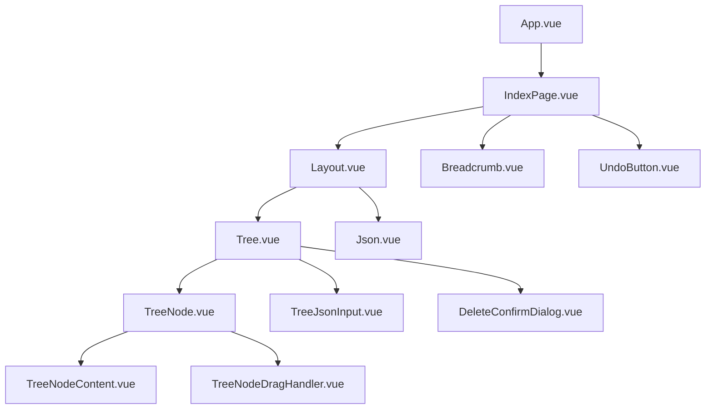

# Architecture

Tree Explorer is a client-only Vue 3 application. All state lives in a single Pinia store; components read from the store and dispatch actions for mutations.

## High-Level Flow

## Component Layers

## State Model

The `treeStore` holds:

| Field | Purpose |
| --- | --- |
| `jsonData` | Parsed JSON tree (object or array root) |
| `selectedPath` | Array of keys from root to selected node |
| `history` | Single-step undo snapshot (not persisted) |
| `error` | Last validation or operation error |
| `isLoading` | Import in progress |

Persistence (via `pinia-plugin-persistedstate`) saves `jsonData` and `selectedPath` to `localStorage` under the key `tree-store`.

## Action Responsibilities

| Action | Behavior |
| --- | --- |
| `setJsonData` | Parse, validate size, sanitize keys, set root selection |
| `deleteNode` | Remove node, push history, reselect parent |
| `renameNode` | Rename while preserving key order |
| `addSiblingNode` | Add first child, promote primitives to objects |
| `moveNode` | Drag-drop reposition with cycle guard |
| `undoLastAction` | Restore last history snapshot |
| `clearJsonData` | Reset tree and selection |

## Drag-and-Drop

`TreeNodeDragHandler.vue` wraps each node and splits the row into three drop zones (before / inside / after). It delegates the actual tree mutation to `moveNode`, which rejects moves where the target is a descendant of the source.

## Security Utilities

`src/stores/treeStore/utils.js` provides:

- `MAX_JSON_SIZE` (5 MB import cap)
- `sanitizeValue` / `sanitizeObject` for safe key handling
- `isInvalidMove` for descendant cycle detection

## Build Pipeline

Vite bundles the app for static hosting. Vue DevTools plugin is enabled only in development mode. Production output is plain static files suitable for nginx or any static host.

## Testing

Vitest tests the Pinia actions in isolation with a fresh store per test. Component tests are not required for the current scope; store tests cover core business logic.
